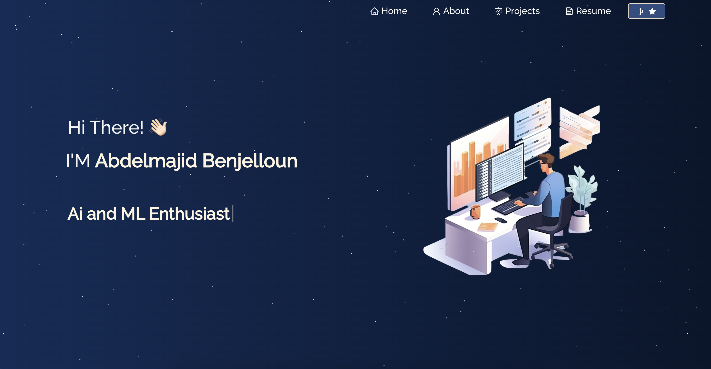

Sure, here's a comprehensive README file for your React portfolio project, including instructions on how users can clone and start the project.

```markdown
# Abdelmajid Benjelloun - AI and ML Developer Portfolio

Welcome to my portfolio website. This project showcases my work as an AI and ML developer, highlighting various projects, skills, and experiences. The site is built using React and hosted on Netlify.



## Live Demo

You can visit the live demo of my portfolio [here](https://abdelmajidbenjelloun.netlify.app/).

## Features

- Overview of my AI and ML projects
- Details about my skills and expertise
- Contact form for reaching out to me
- Responsive design for optimal viewing on different devices

## Technologies Used

- React
- JavaScript
- HTML5
- CSS3
- Netlify (for deployment)

## Getting Started

To get a local copy up and running, follow these simple steps.

### Prerequisites

Make sure you have the following installed:

- Node.js
- npm (Node package manager)

### Installation

1. **Clone the repo**

   ```sh
   git clone https://github.com/your-username/your-repo-name.git
   ```

2. **Navigate to the project directory**

   ```sh
   cd portfolio-
   ```

3. **Install NPM packages**

   ```sh
   npm install
   ```

### Running the Project

1. **Start the development server**

   ```sh
   npm start
   ```

   This will start the React development server and open your portfolio in your default web browser. You can access it at `http://localhost:3000`.

### Building for Production

To create a production build of the project, use the following command:

```sh
npm run build
```

This will bundle the React app into static files for production.

## Deployment

The project is deployed on Netlify. You can deploy your own version by following these steps:

1. **Fork the repository** and push your changes.
2. **Login to Netlify** and create a new site from Git.
3. **Select your repository** and follow the deployment instructions.

## Contact

Feel free to reach out to me via the contact form on my portfolio site or through the following channels:

- Email: [your-email@example.com](mailto:abdelmajidbenjelloun5@gmail.com)
- LinkedIn: [Your LinkedIn Profile]([https://www.linkedin.com/in/your-profile](https://www.linkedin.com/in/abdelmajid-benjelloun-538649218/))

---

Thank you for visiting my portfolio!

```
